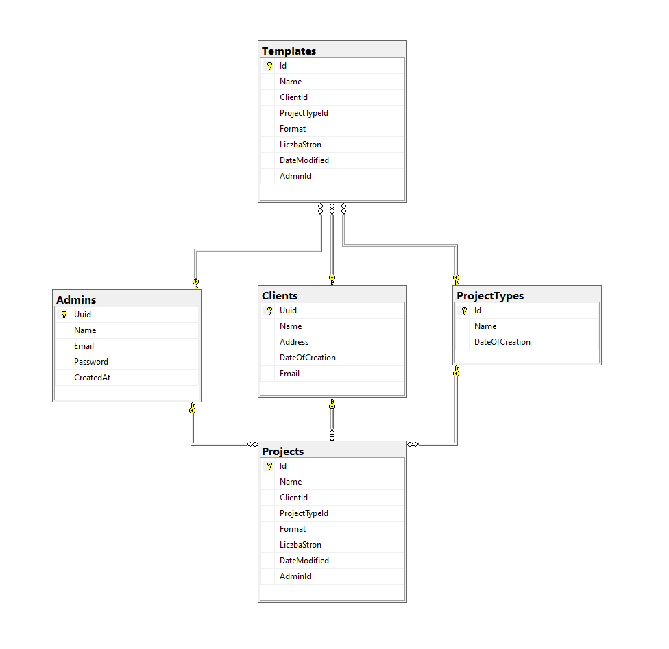

Zasady:

1. Nie mergujemy nie swój branch
2. Żeby mergować trzeba conajmniej jeden approve
3. Używamy tylko squash merge
4. Branchy na razie nie usuwamy po merge
5. Nie robimy komitów do brancha develop lub main, tylko tworzymy Pull request ([Patrz gitflow](https://www.atlassian.com/pl/git/tutorials/comparing-workflows/gitflow-workflow))
6. Nazwa brancha ma zaczynać się od feature/ albo bugfix/
7. W obszrze Githuba używamy angielskiego, czyli: Komity, nazwy branchy, nazwy zmiennych w kodzie i t.d. mają być w języku angielskim (poza wyjątkiem tego pliku :) )
8. Jirę prowadzimy po polsku

# Printing Management System (PMS)

## Overview

The Printing Management System (PMS) is a comprehensive system for managing printing projects. It includes both backend and frontend components. The backend is built with .NET and Entity Framework Core, while the frontend is built with React and TypeScript.

## Table of Contents

- [Printing Management System (PMS)](#printing-management-system-pms)
  - [Overview](#overview)
  - [Table of Contents](#table-of-contents)
  - [Project Structure](#project-structure)
  - [Backend (API)](#backend-api)
    - [Controllers](#controllers)
    - [Enums](#enums)
    - [Interfaces](#interfaces)
    - [Migrations](#migrations)
    - [Models](#models)
    - [Repositories](#repositories)
    - [Services](#services)
  - [Frontend (UI)](#frontend-ui)
  - [Database](#database)
    - [Schema](#schema)
  - [Dependencies](#dependencies)
    - [Backend (API)](#backend-api-1)
    - [Frontend (UI)](#frontend-ui-1)
  - [Setup Instructions](#setup-instructions)
    - [Backend (API)](#backend-api-2)
    - [Frontend (UI)](#frontend-ui-2)

## Project Structure

```
├───.github
│   └───workflows
├───api
│   └───PMS-Api
│       └───PMS-Api
│           ├───Controllers
│           ├───Enums
│           ├───Interfaces
│           ├───Migrations
│           ├───Model
│           │   ├───DbModel
│           │   └───Requests
│           ├───Properties
│           ├───Repository
│           └───Service
├───documentation and db scripts
│   └───how_to_setup
└───ui
    └───pms-ui
        ├───public
        │   └───assets
        │       ├───fonts
        │       │   └───Open_Sans
        │       └───images
        └───src
            ├───authorizationWrappers
            ├───components
            │   ├───clients
            │   │   └───Dialogs
            │   │       ├───CreateClientDialog
            │   │       ├───DeleteClientDialog
            │   │       └───EditClientDialog
            │   ├───editor
            │   ├───layouts
            │   ├───login
            │   ├───params
            │   ├───projects
            │   │   └───Dialogs
            │   ├───projectType
            │   │   └───Dialogs
            │   │       ├───CreateProjectTypeDialog
            │   │       ├───DeleteProjectTypeDialog
            │   │       └───EditProjectTypeDialog
            │   ├───reusable
            │   └───users
            ├───hooks
            ├───model
            ├───providers
            └───utility
```

## Backend (API)

The backend is implemented using .NET and Entity Framework Core. It includes the following key components:

#### Controllers

Handle HTTP requests and route them to the appropriate services or repositories.

- [`AdminController`](api/PMS-Api/PMS-Api/Controllers/AdminController.cs): Manages user-related operations.
- [`AuthController`](api/PMS-Api/PMS-Api/Controllers/AuthController.cs): Handles authentication and authorization.
- [`ClientController`](api/PMS-Api/PMS-Api/Controllers/ClientController.cs): Manages client-related operations.
- [`ParametersController`](api/PMS-Api/PMS-Api/Controllers/ParametersController.cs): Manages parameter-related operations.
- [`ProjectController`](api/PMS-Api/PMS-Api/Controllers/ProjectController.cs): Manages project-related operations.
- [`TemplateController`](api/PMS-Api/PMS-Api/Controllers/TemplateController.cs): Manages template-related operations.
- [`ProjectTypeController`](api/PMS-Api/PMS-Api/Controllers/ProjectTypeController.cs): Manages project type-related operations.

#### Enums

Define the enumerations used in the project.

- [`CreateAdminResult`](api/PMS-Api/PMS-Api/Enums/CreateAdminResult.cs): Enum representing the result of creating an admin.
- [`CreateClientResult`](api/PMS-Api/PMS-Api/Enums/CreateClientResult.cs): Enum representing the result of creating a client.

#### Interfaces

Define the contracts for services.

- [`IAuthService`](api/PMS-Api/PMS-Api/Interfaces/IAuthService.cs): Interface for authentication services.
- [`IUser`](api/PMS-Api/PMS-Api/Interfaces/IUser.cs): Interface representing a user entity.
- [`IUserRepository`](api/PMS-Api/PMS-Api/Interfaces/IUserRepository.cs): Interface for user repository operations.

#### Migrations

Manage database schema changes.

- [`20241108184132_init`](api/PMS-Api/PMS-Api/Migrations/20241108184132_init.Designer.cs): Initial migration.
- [`20241108200930_moreTestingData`](api/PMS-Api/PMS-Api/Migrations/20241108200930_moreTestingData.Designer.cs): Adds more testing data.
- [`20241111150825_changeProjectTemplateModel`](api/PMS-Api/PMS-Api/Migrations/20241111150825_changeProjectTemplateModel.Designer.cs): Changes the project template model.
- [`20241126173504_changeClientModel`](api/PMS-Api/PMS-Api/Migrations/20241126173504_changeClientModel.Designer.cs): Changes the client model.
- [`20241214133914_renameProductsIntoProjectType`](api/PMS-Api/PMS-Api/Migrations/20241214133914_renameProductsIntoProjectType.Designer.cs): Renames products into project type.
- [`PmsContextModelSnapshot`](api/PMS-Api/PMS-Api/Migrations/PmsContextModelSnapshot.cs): Snapshot of the current model.

#### Models

Define the data structures.

- **DbModels**:

  - [`Admin`](api/PMS-Api/PMS-Api/Model/DbModel/Admin.cs): Represents an admin entity.
  - [`Client`](api/PMS-Api/PMS-Api/Model/DbModel/Client.cs): Represents a client entity.
  - [`Parameter`](api/PMS-Api/PMS-Api/Model/DbModel/Parameter.cs): Represents a parameter entity.
  - [`PmsContext`](api/PMS-Api/PMS-Api/Model/DbModel/PmsContext.cs): Represents the database context.
  - [`Project`](api/PMS-Api/PMS-Api/Model/DbModel/Project.cs): Represents a project entity.
  - [`ProjectType`](api/PMS-Api/PMS-Api/Model/DbModel/ProjectType.cs): Represents a project type entity.
  - [`Template`](api/PMS-Api/PMS-Api/Model/DbModel/Template.cs): Represents a template entity.

- **Requests**:

  - [`AuthenticateAdminRequest`](api/PMS-Api/PMS-Api/Model/Requests/AuthenticateAdminRequest.cs): Represents a request to authenticate an admin.
  - [`ChangeNameRequest`](api/PMS-Api/PMS-Api/Model/Requests/ChangeNameRequest.cs): Represents a request to change a name.
  - [`ChangePasswordRequest`](api/PMS-Api/PMS-Api/Model/Requests/ChangePasswordRequest.cs): Represents a request to change a password.
  - [`CreateAdminRequest`](api/PMS-Api/PMS-Api/Model/Requests/CreateAdminRequest.cs): Represents a request to create an admin.
  - [`CreateClientRequest`](api/PMS-Api/PMS-Api/Model/Requests/CreateClientRequest.cs): Represents a request to create a client.
  - [`CreateProjectRequest`](api/PMS-Api/PMS-Api/Model/Requests/CreateProjectRequest.cs): Represents a request to create a project.
  - [`CreateProjectTypeRequest`](api/PMS-Api/PMS-Api/Model/Requests/CreateProjectTypeRequest.cs): Represents a request to create a project type.
  - [`CreateTemplateRequest`](api/PMS-Api/PMS-Api/Model/Requests/CreateTemplateRequest.cs): Represents a request to create a template.
  - [`EditClientRequest`](api/PMS-Api/PMS-Api/Model/Requests/EditClientRequest.cs): Represents a request to edit a client.
  - [`EditProjectRequest`](api/PMS-Api/PMS-Api/Model/Requests/EditProjectRequest.cs): Represents a request to edit a project.
  - [`EditTemplateRequest`](api/PMS-Api/PMS-Api/Model/Requests/EditTemplateRequest.cs): Represents a request to edit a template.
  - [`ReplaceProjectTypeRequest`](api/PMS-Api/PMS-Api/Model/Requests/ReplaceProjectTypeRequest.cs): Represents a request to replace a project type.

#### Repositories

Encapsulate data access logic.

- [`AdminRepository`](api/PMS-Api/PMS-Api/Repository/AdminRepository.cs): Handles CRUD operations for users.
- [`ClientRepository`](api/PMS-Api/PMS-Api/Repository/ClientRepository.cs): Handles CRUD operations for clients.
- [`ProjectRepository`](api/PMS-Api/PMS-Api/Repository/ProjectRepository.cs): Handles CRUD operations for projects.
- [`ProjectTypeRepository`](api/PMS-Api/PMS-Api/Repository/ProjectTypeRepository.cs): Handles CRUD operations for project types.
- [`TemplateRepository`](api/PMS-Api/PMS-Api/Repository/TemplateRepository.cs): Handles CRUD operations for templates.

#### Services

Define the business logic and operations.

- [`CookieAuthService`](api/PMS-Api/PMS-Api/Service/CookieAuthService.cs): Provides authentication services using cookies.

## Frontend (UI)

The frontend is implemented using React and TypeScript. It includes the following key components:

- **Components**: Define the UI elements.

  - [`ProjectTypeList`](ui/pms-ui/src/components/projectType/ProjectTypeList.tsx): Displays a list of project types.
  - [`CreateProjectTypeDialog`](ui/pms-ui/src/components/projectType/Dialogs/CreateProjectTypeDialog/CreateProjectTypeDialog.tsx): Dialog for creating a new project type.
  - [`ClientSelector`](ui/pms-ui/src/components/projects/ClientSelector.tsx): Dropdown for selecting clients.
  - [`ProjectList`](ui/pms-ui/src/components/projects/ProjectList.tsx): Displays a list of projects and templates.

- **Utilities**: Provide helper functions.
  - [`getAxiosClient`](ui/pms-ui/src/utility/getAxiosClient.ts): Configures Axios for making HTTP requests.
  - [`isStatusCodeSuccessfull`](ui/pms-ui/src/utility/util.ts): Checks if an HTTP status code indicates success.

## Database

#### Schema



## Dependencies

### Backend (API)

The backend dependencies are defined in the [PMS-Api.csproj](api/PMS-Api/PMS-Api/PMS-Api.csproj) file:

```xml
<Project Sdk="Microsoft.NET.Sdk.Web">
  <PropertyGroup>
    <TargetFramework>net8.0</TargetFramework>
    <Nullable>enable</Nullable>
    <ImplicitUsings>enable</ImplicitUsings>
    <RootNamespace>PMS_Api</RootNamespace>
  </PropertyGroup>
  <ItemGroup>
    <PackageReference Include="BCrypt.Net-Next" Version="4.0.3" />
    <PackageReference Include="Microsoft.AspNet.WebApi.Core" Version="5.3.0" />
    <PackageReference Include="Microsoft.AspNet.WebApi.Owin" Version="5.3.0" />
    <PackageReference Include="Microsoft.AspNetCore.Authentication.JwtBearer" Version="8.0.4" />
    <PackageReference Include="Microsoft.EntityFrameworkCore" Version="8.0.10" />
    <PackageReference Include="Microsoft.EntityFrameworkCore.Design" Version="8.0.10">
      <PrivateAssets>all</PrivateAssets>
      <IncludeAssets>runtime; build; native; contentfiles; analyzers; buildtransitive</IncludeAssets>
    </PackageReference>
    <PackageReference Include="Microsoft.EntityFrameworkCore.SqlServer" Version="8.0.10" />
    <PackageReference Include="Microsoft.EntityFrameworkCore.Tools" Version="8.0.4">
      <PrivateAssets>all</PrivateAssets>
      <IncludeAssets>runtime; build; native; contentfiles; analyzers; buildtransitive</IncludeAssets>
    </PackageReference>
    <PackageReference Include="Microsoft.Owin.Cors" Version="4.2.2" />
    <PackageReference Include="Microsoft.Owin.Security.OAuth" Version="4.2.2" />
    <PackageReference Include="Swashbuckle.AspNetCore" Version="6.4.0" />
    <PackageReference Include="System.IdentityModel.Tokens.Jwt" Version="7.5.1" />
  </ItemGroup>
</Project>
```

### Frontend (UI)

The frontend dependencies are defined in the [package.json](ui/pms-ui/package.json) file:

```json
{
  "name": "pms-ui",
  "private": true,
  "version": "0.0.0",
  "type": "module",
  "scripts": {
    "dev": "vite --host 0.0.0.0",
    "build": "tsc && vite build",
    "lint": "eslint . --ext ts,tsx --report-unused-disable-directives --max-warnings 0",
    "preview": "vite preview"
  },
  "dependencies": {
    "@emotion/react": "^11.13.3",
    "@emotion/styled": "^11.13.0",
    "@mui/icons-material": "^5.16.7",
    "@mui/material": "^5.16.7",
    "@mui/x-data-grid": "^6.20.0",
    "@react-pdf-viewer/core": "^3.12.0",
    "@react-pdf-viewer/default-layout": "^3.12.0",
    "@react-pdf-viewer/zoom": "^3.12.0",
    "axios": "^1.7.7",
    "pdfjs-dist": "^2.16.105",
    "react": "^18.3.1",
    "react-dom": "^18.2.0",
    "react-hook-form": "^7.53.2",
    "react-pdf": "^5.7.2",
    "react-router-dom": "^6.23.0"
  },
  "devDependencies": {
    "@types/react": "^18.2.66",
    "@types/react-dom": "^18.2.22",
    "@typescript-eslint/eslint-plugin": "^7.2.0",
    "@typescript-eslint/parser": "^7.2.0",
    "@vitejs/plugin-react": "^4.2.1",
    "eslint": "^8.57.0",
    "eslint-plugin-react-hooks": "^4.6.0",
    "eslint-plugin-react-refresh": "^0.4.6",
    "typescript": "^5.2.2",
    "vite": "^5.2.0",
    "vite-plugin-mkcert": "^1.17.5"
  }
}
```

## Setup Instructions

### Backend (API)

1. **Prerequisites**:

   - Install the latest version of Visual Studio 2022.
   - Install .NET 8.

2. **Setup**:

   - Open the `api/PMS-Api/PMS-Api.sln` solution file in Visual Studio.
   - Configure the database connection string in `appsettings.Development.json`.
   - Run the following commands in the Package Manager Console to apply migrations and update the database:
     ```sh
     Update-Database
     ```

3. **Run**:
   - Press `F5` in Visual Studio to build and run the API.

### Frontend (UI)

1. **Prerequisites**:

   - Install Node.js and npm.

2. **Setup**:

   - Open the `ui/pms-ui` folder in Visual Studio Code.
   - Open the terminal and run the following command to install dependencies:
     ```sh
     npm install
     ```

3. **Run**:
   - Start the development server by running:
     ```sh
     npm run dev
     ```
   - Open `http://localhost:5173/` in your browser to access the UI.
